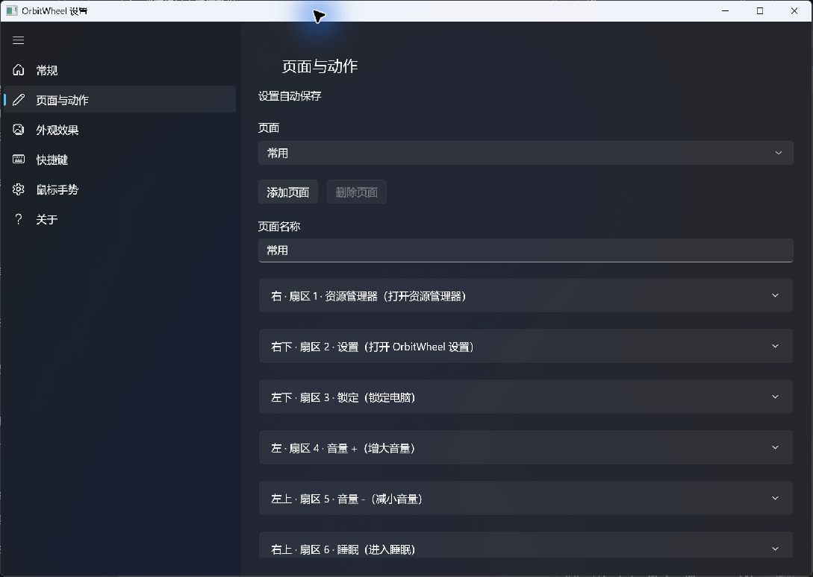

# OrbitWheel

Windows 径向快捷操作工具。在鼠标位置召出六等分圆环，快速启动应用、打开文件夹或执行系统操作。

**简体中文** · [English](README.en.md)

[](https://github.com/V0idream/OrbitWheel/releases/latest)
[](LICENSE)

## 界面预览

新版 WinUI 3 设置界面使用 Fluent 原生控件，提供常规、页面与动作、外观效果、快捷键、鼠标手势和关于六个页面。



截图来自当前 2.1 源码对应的本地构建，使用默认配置；公开发行版本以 [Releases](https://github.com/V0idream/OrbitWheel/releases) 为准。

## 功能

- 六等分径向菜单，扇区从右侧起顺时针编号 `1–6`，可添加多个页面。
- 支持点击执行、按住快捷键并松开执行，以及数字键选择扇区。
- 启动桌面程序和 Store / UWP 应用，打开文件夹，执行自定义命令或常用系统操作。
- 目标应用已运行时，优先切换到现有窗口，并提供系统托盘唤醒兼容逻辑。
- 提供液态玻璃、高斯模糊和亚克力三种圆环效果；靠近屏幕边缘时自动调整位置。
- 可选鼠标手势：同时按住左右键，上滑打开开始菜单，下滑显示桌面，左右滑打开并切换 `Alt+Tab` 窗口。
- 设置自动保存，支持随 Windows 启动和系统托盘常驻。

## 下载与运行

1. 在 [Releases](https://github.com/V0idream/OrbitWheel/releases/latest) 下载文件名以 `-self-contained.zip` 结尾的自包含包。
2. 完整解压，保留 `Settings` 目录，运行根目录的 `OrbitWheel.exe`。
3. 双击系统托盘图标打开设置，在“快捷键”页录制组合键，在“页面与动作”页配置扇区。

当前源码的运行要求为 Windows 10 2004 或更高版本（x64）、.NET Framework 和 Visual C++ x64 运行库。自包含包已携带 .NET 与 Windows App SDK 运行时；共享运行时包另需 .NET 10 x64 Runtime 和匹配的 Windows App Runtime 1.8。系统背景效果取决于 Windows 版本与系统设置，详见 [部署说明](docs/winui-deployment.md)。

## 基本操作

| 操作 | 方法 |
| --- | --- |
| 默认快捷键 | `Ctrl + Space`，可在设置中修改 |
| 按住模式 | 按住快捷键，将鼠标移向扇区，松开执行 |
| 点击模式 | 按快捷键打开圆环，点击扇区执行 |
| 直接执行扇区 | 圆环显示时按数字键 `1–6` |
| 切换页面 | 鼠标滚轮或左右方向键 |
| 取消 | 按 `Esc`；按住模式也可回到中心后松开 |

配置文件位于：

```text
%APPDATA%\OrbitWheel\config.json
```

关闭设置窗口不会退出主程序；退出程序请使用系统托盘菜单。

## 从源码构建

在 Windows 上安装 .NET SDK 10.0.400，使用 Windows PowerShell 5.1 执行：

```powershell
powershell.exe -NoProfile -ExecutionPolicy Bypass -File .\scripts\package-release.ps1
```

脚本构建主程序与 WinUI 设置，自动还原 NuGet 依赖，并生成两个部署包：

```text
dist\release\OrbitWheel-2.1-self-contained.zip
dist\release\OrbitWheel-2.1-framework-dependent.zip
```

同目录包含 `SHA256SUMS.txt`、`PACKAGE-SIZES.json` 和发行说明。单独运行 `build.ps1` 只构建主程序，完整运行包需使用上述打包脚本。

## 贡献与反馈

问题反馈和功能建议请提交到 [Issues](https://github.com/V0idream/OrbitWheel/issues)。开发与验证流程见 [贡献指南](CONTRIBUTING.md)。

## 许可证

[MIT License](LICENSE)
